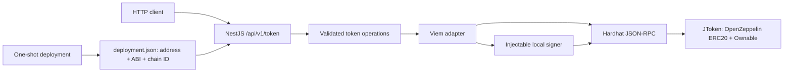

# ERC-20 interaction service

A small Solidity/NestJS service that demonstrates precise token operations, an explicit signing boundary, and reproducible local integration tests.

**Scope:** a local custodial demo with fake funds. Not audited, production-ready, or suitable for real custody. Never import real keys or fund these accounts.

## Architecture



- TypeScript, NestJS 11, Viem 2, Solidity 0.8.28, OpenZeppelin 5, Hardhat 2, Node.js 24 LTS.
- JToken (`JTK`) has 18 decimals, an explicit owner, 1,000 initial tokens in the local deployment, and owner-only minting.
- The HTTP caller requests actions from **one configured demo account**. The RPC node signs using its unlocked test account; the API never receives a private key.
- Every amount uses an explicit `amountBaseUnits` integer **string**. `"1000000000000000000"` means 1 JTK. No token arithmetic uses JavaScript numbers.
- Writes simulate, submit, and wait for one successful receipt. Responses include `transactionHash`, `status`, `blockNumber`, and normalized values.

## Run locally

Prerequisites: Docker Engine/Desktop with Docker Compose v2 or newer; ports 3000 and 8545 available. No local Node installation or environment file is needed for Compose.

```bash
docker compose up --build
```

Compose waits for a healthy chain, completes deployment, then starts the API. Both ports are published only on `127.0.0.1`. Chain state is in memory; the named volume contains only deployment metadata.

- [Swagger UI](http://127.0.0.1:3000/api/docs)
- [Liveness](http://127.0.0.1:3000/health/live): process can serve requests.
- [Readiness](http://127.0.0.1:3000/health/ready): RPC chain ID, deployed bytecode, token metadata, and configured account are available.

For a detached launch that waits for readiness:

```bash
docker compose up --build --wait --wait-timeout 180
```

If a host port is occupied, select another without changing internal container URLs:

```bash
export API_PORT=3001 RPC_PORT=8546
docker compose up --build --wait --wait-timeout 180
```

Use the selected API port in browser links and set `API_URL=http://127.0.0.1:3001` when running `npm run demo:smoke`.

### API walkthrough

Run in another terminal. These are public Hardhat **test addresses**, not wallet credentials:

```bash
API=http://127.0.0.1:${API_PORT:-3000}
OWNER=0xf39Fd6e51aad88F6F4ce6aB8827279cffFb92266
RECIPIENT=0x70997970C51812dc3A010C7d01b50e0d17dc79C8

curl -fsS "$API/api/v1/token/metadata"
curl -fsS "$API/api/v1/token/balance?address=$OWNER"

curl -fsS -X POST "$API/api/v1/token/mint" \
  -H 'Content-Type: application/json' \
  -d "{\"to\":\"$RECIPIENT\",\"amountBaseUnits\":\"1000000000000000000\"}"

curl -fsS -X POST "$API/api/v1/token/transfer" \
  -H 'Content-Type: application/json' \
  -d "{\"to\":\"$RECIPIENT\",\"amountBaseUnits\":\"9007199254740993\"}"

# This single-account walkthrough deliberately uses self-allowance.
# Integration tests use separate owner and spender API instances.
curl -fsS -X POST "$API/api/v1/token/approve" \
  -H 'Content-Type: application/json' \
  -d "{\"spender\":\"$OWNER\",\"amountBaseUnits\":\"20\"}"

curl -fsS -X POST "$API/api/v1/token/transfer-from" \
  -H 'Content-Type: application/json' \
  -d "{\"from\":\"$OWNER\",\"to\":\"$RECIPIENT\",\"amountBaseUnits\":\"7\"}"

curl -fsS "$API/api/v1/token/allowance?owner=$OWNER&spender=$OWNER"
# allowanceBaseUnits is "13" after the two commands above.
```

All successful operations return HTTP 200. Errors use `{ "error": { "code": "...", "message": "..." } }`: validation 400, mint authorization 403, contract revert 422, unavailable chain 503, receipt timeout 504. Once submitted, a confirmation failure also returns the transaction hash: check it before retrying. There is no idempotency layer.

## Development and verification

Use Node version in `.nvmrc` (24.21.0) and npm 11. One root lockfile covers both workspaces.

```bash
npm ci
npm run verify          # formatting, lint, types, builds, contract/unit/API/chain tests
npm run audit:security  # reports advisories; fails on high/critical findings
```

Individual checks:

```bash
npm run format:check
npm run lint
npm run typecheck
npm run build
npm run test:contracts
npm run test:backend
npm run test:integration  # requires build; starts and cleans up its own chain + APIs
npm run demo:smoke        # requires the running Compose demo; mints one base unit
```

CI repeats these checks from a clean install and boots the complete Compose stack. Solidity uses the pinned npm `solc` compiler, so builds do not fetch a compiler dynamically. See [verification and baseline](docs/hardening-report.md) for measured results and [dependency decisions](docs/dependencies.md) for accepted audit findings.

For a host-only setup, run `npm run dev:chain`, then `npm run dev:deploy` in a second terminal. Create a local ignored `.env` from the placeholder-only `.env.example` with `NODE_ENV=development`, `LOCAL_DEMO=true`, `SIGNER_MODE=hardhat-local`, `SIGNER_ACCOUNT_INDEX=0`, `CHAIN_ID=31337`, `RPC_URL=http://127.0.0.1:8545`, `DEPLOYMENT_FILE=shared/deployment.json`, `HOST=127.0.0.1`, and `PORT=3000`. After `npm run build`, start `npm run dev:api` from the repository root.

Cleanup:

```bash
docker compose down --volumes --remove-orphans
```

A new chain discards balances, allowances, and transaction history. Restart the whole stack after stopping/replacing the chain so deployment runs again.

## Repository

```text
backend/src/       DTOs, configuration, token service, Viem adapter, signer, health
smart-contract/    JToken, local compiler configuration, deployment, contract tests
scripts/           disposable-chain integration tests, health probes, smoke check
Dockerfile         pinned Node images; separate chain/build and API runtime targets
docs/              security boundary, amount decision, dependencies, verification
```

## What this demonstrates

- ERC-20 authorization and allowance semantics, verified through real transactions.
- Precision-safe HTTP validation and JSON serialization.
- An injectable signer port, sanitized errors, and readiness based on actual chain state.
- Health-gated containers, reproducible package/compiler versions, and CI evidence.

The local signer requires explicit opt-in and refuses production mode, external RPC hosts, and chain IDs other than 31337. This is an accident-prevention boundary, not authentication. There is no real-key storage, public-network deployment, database, frontend, or production custody implementation. See [security and limitations](docs/security.md) and [amount representation](docs/adr-amounts.md).
